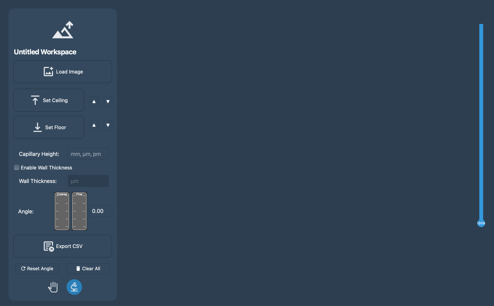
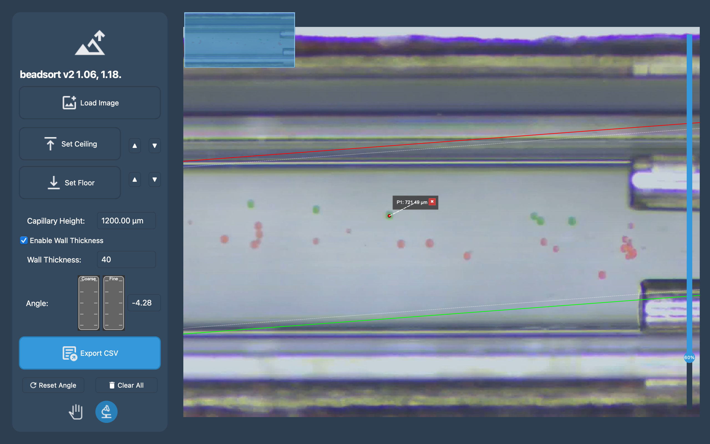
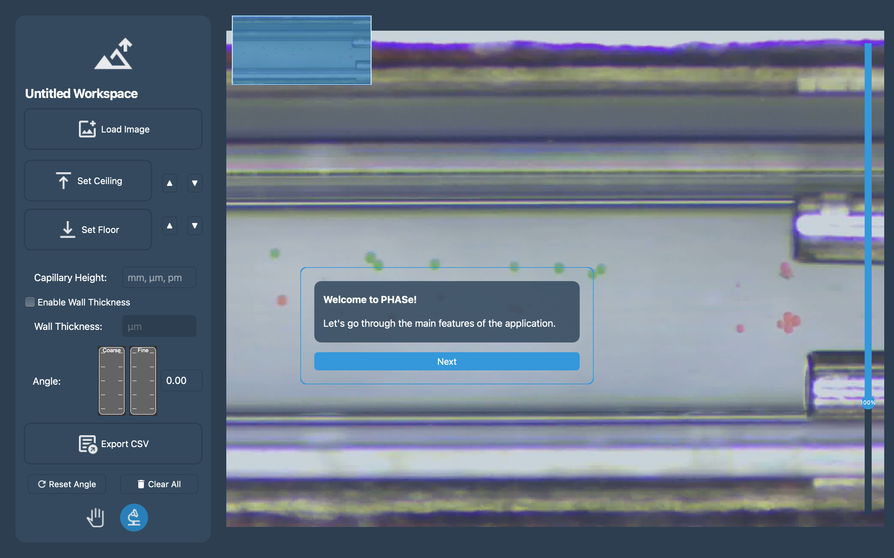
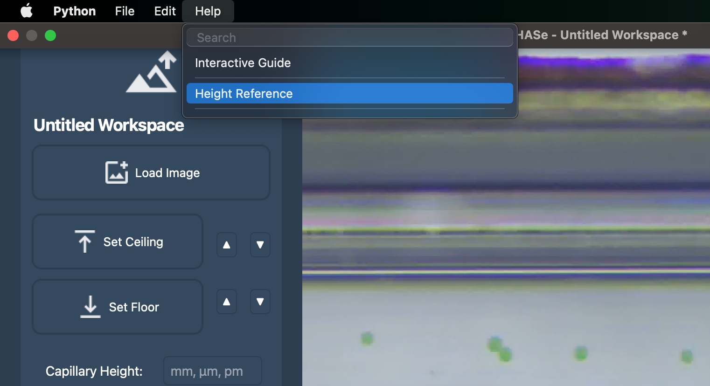

# 1. Introduction

## What is PHASe?

PHASe (Particle Height Analysis Software) is a specialized tool designed for measuring particle heights in capillary
systems. Developed by VX Software, PHASe provides researchers and scientists with an intuitive interface for accurate
particle height measurements in microscopy images.


*PHASe's main interface showing the control panel (left) and image workspace (right)*

## Key Features

- **Precise Height Measurements**: Calculate particle heights with micrometer accuracy
- **Smart Calibration**: Built-in tools for capillary height calibration
- **Wall Thickness Compensation**: Account for capillary wall thickness in measurements
- **Angle Correction**: Adjust for tilted capillaries with precision controls
- **Data Export**: Export measurements in CSV format for further analysis
- **Workspace Management**: Save and load complete workspaces for continued analysis


*Key features demonstrated in a single composite image*

## System Requirements

- **Operating System**:
    - macOS 10.14 (Mojave) or later
    - Linux (major distributions)
- **Hardware**:
    - Minimum 4GB RAM
    - 1920x1080 display resolution recommended
    - 120MB free disk space

## Installation Guide

### Standard Installation

[IMAGE 3: Installation Steps]
*Caption: Step-by-step installation process*

- Required image specs: 600x800px step-by-step screenshot sequence
- Should show:
    1. Download page
    2. Installation wizard
    3. First launch screen

1. Download the appropriate installer for your operating system from the official website
2. Run the installer:
    - macOS: Double-Click the .dmg file.
    - Linux: Use the provided .AppImage
3. Follow the installation wizard's instructions
4. Launch PHASe from your applications menu

### First-Time Setup

Upon first launch, PHASe will:

- Create necessary configuration folders
- Set up file associations
- Install required fonts
- Configure default settings


*PHASe's welcome screen and interactive guide, which pops up when you load your first image.*

## Getting Help

PHASe includes several ways to get help:

- Interactive Guide (Help → Interactive Guide)
- Height Reference tool (Help → Height Reference)
  

- Official documentation (this guide)

# 2. Getting Started

## First Launch

When launching PHASe for the first time, you'll be greeted with a clean workspace and intuitive control panel. Let's
understand the key areas of the interface.


*Fresh PHASe workspace with labeled key areas*

1. Control Panel
2. Workspace Area
3. Menu Bar
4. Status Indicators

## Interface Overview

### Control Panel Elements

[IMAGE 2: Control Panel Detailed]
*Caption: Detailed view of the control panel with all major controls labeled*

- Required image specs: 300x800px
- Should show and label:
    1. Load Image button
    2. Ceiling/Floor controls
    3. Height input
    4. Wall thickness options
    5. Angle adjustment wheels
    6. Mode switch
    7. Export button

The control panel is organized into logical sections:

1. **Image Loading**: Top section for loading and managing images
2. **Measurement Controls**: Middle section for setting up measurements
3. **Analysis Tools**: Lower section for detailed analysis
4. **Export Options**: Bottom section for data export

### Mode Selection

[IMAGE 3: Mode Switch Demonstration]
*Caption: Switching between Pan and Particle modes*

- Required image specs: 400x200px sequence
- Should show:
    1. Pan mode activated (with hand cursor)
    2. Particle mode activated (with crosshair cursor)
    3. Animation of switch between modes

## Understanding the Workspace

### Workspace Components

[IMAGE 4: Workspace Areas]
*Caption: Main workspace components and their functions*

- Required image specs: 1000x600px annotated screenshot
- Should show:
    1. Image viewing area
    2. Minimap
    3. Zoom controls
    4. Measurement overlay
    5. Particle labels

### Navigation Tools

[IMAGE 5: Navigation Features]
*Caption: Available navigation and zoom tools*

- Required image specs: 800x400px composite
- Should demonstrate:
    1. Zoom slider usage
    2. Minimap navigation
    3. Pan mode in action
    4. Mouse wheel zoom

## File Management

### File Types

PHASe works with several file types:

Program files:

- `.phw`: PHASe workspace files, containing all data and settings
- `.csv`: Exported measurement data

Image files:

- `.png` (recommended)
- `.jpg`
- `.tif` (may produce visual artifacts during zooming)

### Auto-Save and Recovery

PHASe includes automatic workspace protection:

- Unsaved changes warnings
- Recovery of last session

# 3. Basic Operations

## Loading Images

The first step in any analysis is loading your capillary image. PHASe supports common image formats and provides tools
for optimal image handling.

[IMAGE 1: Image Loading Sequence]
*Step-by-step process of loading and preparing an image*

### Image Requirements

- Recommended resolution: 1920x1080 or higher
- Supported formats: PNG, JPG, TIF
- Clear visibility of capillary edges
- Good contrast between particles and background

[IMAGE 2: Image Quality Examples]
*Comparison of suitable and unsuitable images*

## Setting Capillary Boundaries

### Setting the Ceiling

[IMAGE 3: Ceiling Setting Process]
*Setting the capillary ceiling boundary*

### Setting the Floor

[IMAGE 4: Floor Setting Process]

### Boundary Adjustment Tips

[IMAGE 5: Floor Ceiling Adjustment Features]
*Caption: Fine-tuning boundary positions*

- Required image specs: 400x600px showing:
    1. Up/down adjustment buttons
    2. Keyboard shortcuts
    3. Direct click-and-drag adjustment
    4. Visual alignment guides

### Setting Capillary Height

### Height Input

- Always include units (μm, mm, or pm)
- Use decimal points for precise measurements

## Working with Wall Thickness

### Enabling Wall Thickness

[IMAGE 8: Wall Thickness Configuration]
*Setting up wall thickness compensation*

- gif image maybe...

# 4. Particle Analysis

## Understanding Particle Mode

Particle analysis is the core functionality of PHASe. Before starting measurements, ensure you're in Particle Mode by
checking the mode switch in the control panel. The cursor will change to a crosshair when properly enabled, indicating
you're ready to select particles.

## Selecting Particles

The particle selection process follows a systematic approach:

1. **Initial Setup Requirements**:
    - Capillary boundaries must be set (ceiling and floor)
    - Capillary height must be calibrated
    - Image should be properly zoomed for accurate selection

2. **Selection Process**:
    - Click directly on the center of each particle
    - A marker dot appears at the selection point
    - A label automatically generates showing the height
    - Labels can be dragged to optimal positions for clarity

3. **Selection Tips**:
    - Use the zoom feature for precise selection
    - Look for the particle's widest point
    - Maintain consistent selection criteria across particles
    - Consider using the pan mode to navigate between distant particles

## Label Management

### Automatic Labels

Each particle selection creates a label containing:

- Height measurement in micrometers
- Optional custom name
- Connection line to the particle

[IMAGE: Label]

### Label Customization

1. **Naming Particles**:
    - Right-click any label
    - Choose "Rename" option
    - Enter custom identifier
    - Names are saved with workspace

2. **Label Positioning**:
    - Click and drag labels to any position
    - Labels maintain connection lines to particles
    - Automatic collision avoidance between labels
    - Smart positioning suggestions

3. **Label Organization**:
    - Group similar particles with consistent naming
    - Use clear naming conventions
    - Maintain readable spacing between labels
    - Adjust label size using the slider for optimal visibility

### Label Features

1. **Quick Actions**:
    - Delete: Click the X button on label
    - Rename: Right-click > Rename
    - Reposition: Drag and drop
    - Select from existing names: Right-click > Select Name

2. **Additional Information**:
    - Height in micrometers
    - Relative position percentage
    - Custom notes (if enabled)
    - Error margin indicators

[IMAGE: Image of a label, highlighting key features]

## Data Validation

### Quality Checks

PHASe automatically validates measurements:

- Warns about unusual height variations
- Flags potentially incorrect selections
- Indicates when particles are too close to walls
- Suggests optimal selection points

### Measurement Verification

Best practices for ensuring accurate measurements:

1. **Visual Verification**:
    - Check alignment with capillary boundaries
    - Verify selection points are centered
    - Ensure labels are clearly visible
    - Confirm connection lines are accurate

2. **Statistical Verification**:
    - Compare similar particles
    - Look for measurement consistency
    - Check for outliers

## Measurement Management

### Organization Strategies

1. **Systematic Approach**:
    - Work left to right
    - Group similar particles
    - Use consistent naming patterns
    - Document measurement conditions

2. **Data Integrity**:
    - Regular workspace saves
    - Backup measurements
    - Document any special conditions
    - Note any calibration changes

[IMAGE: Selection Process Overview]
*Essential elements of particle selection and measurement*

# Height Calculation in PHASe

## Basic Height Calculation

### Step 1: Relative Position Calculation

The first step is calculating the relative position of a particle between the ceiling and floor:

```
relative_position = (ceiling_y - particle_y) / (ceiling_y - floor_y)
```

Where:

- `ceiling_y` = Y-coordinate of ceiling line (in pixels)
- `particle_y` = Y-coordinate of selected particle (in pixels)
- `floor_y` = Y-coordinate of floor line (in pixels)

This gives a value between 0 and 1, where:

- 0 = particle is at floor level
- 1 = particle is at ceiling level

### Step 2: Basic Height Conversion

Without any corrections, the basic height is:

```
basic_height = capillary_height × relative_position
```

Where:

- `capillary_height` = Known height of capillary (in μm)

## Advanced Height Calculation

### Step 3: Wall Thickness Compensation

When wall thickness is enabled:

```
effective_height = capillary_height - (2 × wall_thickness) compensated_height = (relative_position × effective_height) + wall_thickness
```

Where:

- `wall_thickness` = Thickness of capillary wall (in μm)

### Step 4: Angle Correction

For tilted capillaries:

```
- angle_radians = angle_degrees × (π/180) 

- final_height = compensated_height / cos(angle_radians)
```

Where:

- `angle_degrees` = Tilt angle of the capillary (in degrees)